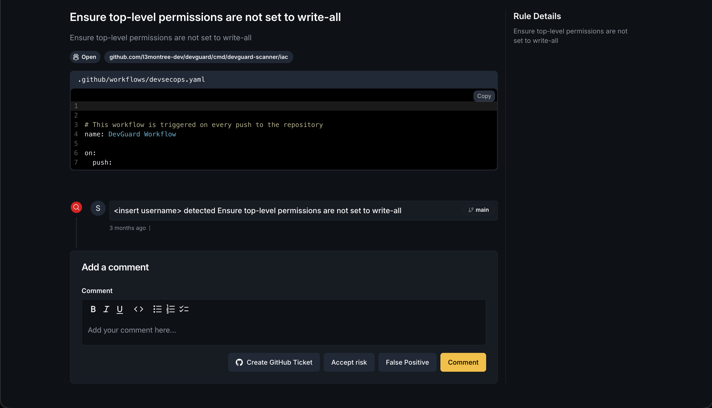

import { Callout, Tabs } from 'nextra/components'

# Scan Source Code

Analyze your source code for security vulnerabilities, misconfigurations, and exposed secrets. DevGuard performs Static Application Security Testing (SAST), Infrastructure as Code (IaC) scanning, and secret detection to identify issues before deployment.

## Prerequisites

Before you begin, ensure you have:

- Docker installed on your system
- A personal access token from DevGuard (create one in user settings)
- A repository created in DevGuard
- Source code repository accessible locally or in your CI/CD pipeline

## Scan Source Code

<Tabs items={['SAST', 'Secret Scanning', 'Infrastructure as Code']}>
  <Tabs.Tab>
    Run Static Application Security Testing (SAST) on your source code using Semgrep:

    ```bash copy
    docker run -v "$(PWD):/app" ghcr.io/l3montree-dev/devguard/scanner:main-latest \
      devguard-scanner sast \
        --path=/app \
        --assetName="myorg/projects/myproject/assets/myrepo" \
        --apiUrl="https://api.devguard.org" \
        --token="YOUR_TOKEN"
    ```

    <Callout type="info">
      SAST analyzes source code for security vulnerabilities, logic flaws, and coding issues using pattern matching and semantic analysis.
    </Callout>
  </Tabs.Tab>

  <Tabs.Tab>
    Run secret scanning to find exposed credentials and API keys using Gitleaks:

    ```bash copy
    docker run -v "$(PWD):/app" ghcr.io/l3montree-dev/devguard/scanner:main-latest \
      devguard-scanner secret-scanning \
        --path=/app \
        --assetName="myorg/projects/myproject/assets/myrepo" \
        --apiUrl="https://api.devguard.org" \
        --token="YOUR_TOKEN"
    ```

    <Callout type="info">
      Secret scanning detects exposed credentials, API keys, tokens, and other sensitive information in your codebase including git history.
    </Callout>
  </Tabs.Tab>

  <Tabs.Tab>
    Run Infrastructure as Code scanning on Kubernetes manifests, Terraform, and Dockerfiles using Checkov:

    ```bash copy
    docker run -v "$(PWD):/app" ghcr.io/l3montree-dev/devguard/scanner:main-latest \
      devguard-scanner iac \
        --path=/app \
        --assetName="myorg/projects/myproject/assets/myrepo" \
        --apiUrl="https://api.devguard.org" \
        --token="YOUR_TOKEN"
    ```

    <Callout type="info">
      IaC scanning analyzes configuration files for security misconfigurations, compliance violations, and best practice violations.
    </Callout>
  </Tabs.Tab>
</Tabs>

<Callout type="info">
  Replace `myorg/projects/myproject/assets/myrepo` with your repository's slug. You can copy this from the URL when viewing your repository in the DevGuard UI.
</Callout>

## What the Scanner Does

### SAST (Static Application Security Testing)
Uses Semgrep to analyze source code for security vulnerabilities:
1. **Code Inspection**: Analyzes source code for security vulnerabilities and logic flaws
2. **Pattern Matching**: Identifies common vulnerability patterns (injection, XSS, authentication issues)
3. **Semantic Analysis**: Understands code flow to detect complex vulnerabilities  
4. **Multi-language Support**: Supports JavaScript, TypeScript, Python, Go, Java, C#, PHP, Ruby, and more
5. **SARIF Report**: Generates a standardized SARIF report with detailed findings

### Secret Scanning
Uses Gitleaks to detect exposed credentials and sensitive information:
1. **Credential Detection**: Finds exposed API keys, passwords, tokens, and other secrets
2. **Git History Scanning**: Analyzes git history to find secrets that may have been committed
3. **Pattern Recognition**: Detects common secret patterns (AWS keys, GitHub tokens, database passwords, etc.)
4. **Entropy Analysis**: Identifies high-entropy strings that may be secrets
5. **Obfuscation**: Automatically obfuscates detected secrets in reports for security

### Infrastructure as Code (IaC)
Uses Checkov to scan infrastructure configuration files:
1. **Configuration Analysis**: Scans Kubernetes manifests, Terraform, CloudFormation, and Docker configurations
2. **Security Best Practices**: Identifies missing security controls (RBAC, network policies, resource limits)
3. **Compliance Checks**: Validates configuration against security standards (CIS, AWS best practices)
4. **Hardening Recommendations**: Suggests security improvements for your infrastructure
5. **SARIF Report**: Generates standardized SARIF report for integration with CI/CD systems

**Verify it worked:** Navigate to your repository in DevGuard. You'll see:
- Detected code vulnerabilities with detailed locations and remediation steps
- Exposed secrets with immediate remediation guidance  
- Infrastructure misconfigurations with fix recommendations
- SARIF reports integrated with GitHub Advanced Security and GitLab SAST

## CI/CD Integration

For automated source code scanning in CI/CD pipelines:
- **GitHub Actions**: Use the [devguard-action](https://github.com/l3montree-dev/devguard-action) with separate reusable workflows for [SAST](https://github.com/l3montree-dev/devguard-action/blob/main/.github/workflows/sast.yml), [Secret Scanning](https://github.com/l3montree-dev/devguard-action/blob/main/.github/workflows/secret-scanning.yml), and [IaC](https://github.com/l3montree-dev/devguard-action/blob/main/.github/workflows/iac.yml)
- **GitLab CI**: Use GitLab CI Components for [SAST](https://gitlab.com/l3montree/devguard/-/blob/main/templates/sast.yml), [Secret Scanning](https://gitlab.com/l3montree/devguard/-/blob/main/templates/secret-scanning.yml), and [IaC](https://gitlab.com/l3montree/devguard/-/blob/main/templates/iac.yml)

## Advanced Options

### Output SARIF Report Locally

Save the SARIF report to a local file in addition to uploading to DevGuard:

```bash copy
--outputPath=/app/results.sarif  # Path to save the SARIF report locally
```

### Path Scanning

Scan only a specific directory:

```bash copy
--path=/app/src           # Only scan source directory
```

### Custom Web UI

Specify a custom DevGuard Web UI URL for results:

```bash copy
--webUI="https://devguard.mycompany.com"  # Custom DevGuard instance URL
```

### Timeout Configuration

Set a custom timeout for long-running scans:

```bash copy
--timeout=600  # Set timeout to 600 seconds (10 minutes). Default is 300 seconds
```

### Tracking & Git Reference

Specify Git reference information to track which branch or tag was scanned:

```bash copy
--ref="feature-branch"         # Git reference (branch, tag, or commit)
--defaultRef="main"            # Default Git reference to use
--isTag=true                   # Indicates if the reference is a tag
```

<Callout type="info">
  These flags help DevGuard track which branch or tag the scan is associated with. DevGuard will attempt to auto-detect Git information from the current directory if these flags are not specified.
</Callout>

## Supported Languages & Frameworks

### SAST (Semgrep)
Semgrep supports many languages out of the box. See [Semgrep language coverage](https://semgrep.dev/docs/language-support/) for the complete list. Common languages include:
- **JavaScript/TypeScript**: React, Vue, Angular, Node.js, Next.js
- **Python**: Django, Flask, FastAPI, Pyramid
- **Go**: Go standard library, Gin, Echo, Chi
- **Java**: Spring, Struts, J2EE, Grpc
- **C#**: .NET, ASP.NET Core, Entity Framework
- **PHP**: Laravel, Symfony, WordPress
- **Ruby**: Rails, Sinatra, Rack
- **And many more**: YAML, JSON, Dockerfile, Terraform, etc.

### Secret Scanning (Gitleaks)
Gitleaks detects secrets in:
- Git repositories and commit history
- Source code files
- Configuration files  
- Environment files

Common secret types detected:
- AWS access keys and secrets
- GitHub tokens and personal access tokens
- Database connection strings
- API keys (Stripe, Slack, SendGrid, etc.)
- Private keys and certificates
- OAuth tokens

### IaC Scanning (Checkov)
Checkov supports infrastructure-as-code frameworks:
- **Kubernetes**: YAML manifests, Helm charts
- **Terraform**: HCL files (`.tf`)
- **CloudFormation**: JSON and YAML templates
- **Docker**: Dockerfile best practices
- **Ansible**: Playbook validation
- **AWS CloudFormation**: Native AWS IaC
- **Azure Resource Manager**: ARM templates
- **Google Cloud Deployment Manager**: Deployment configs

## Best Practices

### Code Scanning
<Callout type="info">
  Scan early and often: Integrate DevGuard into your pre-commit hooks and CI/CD pipelines to catch issues early in development.
</Callout>

### Secret Management
<Callout type="warning">
  If secrets are exposed in source code, rotate them immediately. Do not rely solely on removal from the codebase, as secrets may be in repository history.
</Callout>

- Use environment variables or secure vaults for secrets
- Implement pre-commit hooks to prevent secret commits
- Review DevGuard secret scan results immediately
- Rotate exposed credentials within your infrastructure

### Infrastructure as Code
<Callout type="info">
  Apply the principle of least privilege: Use DevGuard IaC scanning to ensure your configurations follow security best practices.
</Callout>

- Validate configurations in non-production environments first
- Use DevGuard recommendations to harden your infrastructure
- Keep IaC code in version control alongside application code
- Review and approve IaC changes through pull requests

## Troubleshooting

### Scan Runs But Finds No Issues

For SAST:
- Ensure the scanned path includes your source code
- Verify that supported file types are present
- Semgrep scans by default, but you can check [Semgrep rules](https://semgrep.dev/r) to see what's configured
- Review detected issues in DevGuard UI

For Secret Scanning:
- Gitleaks may not find issues if no secrets are present
- Use `--outputPath` to save the SARIF report and inspect it locally
- Check if specific secret patterns are configured in your Gitleaks rules

For IaC:
- Ensure Checkov-compatible configuration files exist (Kubernetes YAML, Terraform, etc.)
- Use `--outputPath` to save the SARIF report and see what was scanned

### High Number of False Positives

SAST scans can produce false positives. To manage them:

1. **Review and Mark as False Positive**: In the DevGuard UI, mark genuine false positives as "false positive" status
    
2. **Semgrep Configuration**: Create a `.semgrep.yml` in your repository to customize rules
3. **Ignore Files**: Use `.semgrepignore` to exclude directories like `node_modules`, `dist`, `build`, etc.

<Callout type="warning">
  Do not ignore security findings without understanding them. False positives should be reviewed by a security-aware developer.
</Callout>

### Exposed Secrets Found

If secret scanning finds exposed secrets:

1. **Immediate Action**: Rotate the exposed secret immediately in your infrastructure
2. **Remove from Repository**: Remove the secret from your codebase
3. **Clean Git History**: Use `git-filter-repo` or `git filter-branch` to remove the secret from commit history
4. **Mark as False Positive**: If it's a test credential or no longer used, mark as false positive in DevGuard
5. **Implement Prevention**: Use pre-commit hooks to prevent future secret commits

<Callout type="warning">
  Removing a secret from code does not guarantee security. Assume the secret has been compromised and rotate it immediately.
</Callout>

### Scan Timeout

If scans are timing out on large repositories:

```bash copy
--timeout=900  # Increase timeout to 900 seconds (15 minutes)
```

For very large codebases:
- Scan specific directories instead of the root: `--path=/app/src`
- Exclude common large directories like `node_modules`, `vendor`, etc. by creating a `.semgrepignore` file
- Consider scanning in CI/CD where more resources are available

### Authentication Issues with Git History

For secret scanning to work properly with private repositories, ensure git credentials are available in your scanning environment. Use CI/CD secrets to pass credentials if needed.