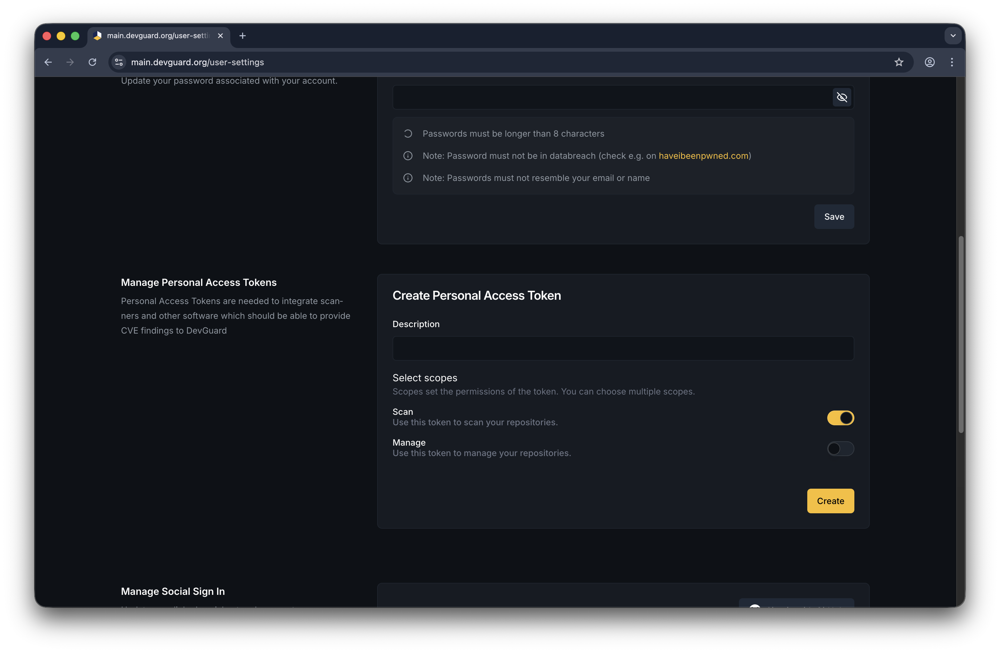

import { Callout, Tabs } from 'nextra/components'

# Create and Manage API Tokens

Create personal access tokens (PATs) to authenticate with the DevGuard API for automation, CI/CD pipelines, and programmatic access.

## Prerequisites

Before you begin, ensure you have:

- DevGuard account access
- Understanding of API authentication basics
- A way to securely store tokens

<Callout type="warning">
  Personal Access Tokens grant full API access with your user's permissions. Treat them like passwords—never commit them to version control or share them, try to use environment variables or secure vaults.
</Callout>

## Manage a Personal Access Token
**Top Right** → User Profile → **Settings** → **API Tokens** → **Create New Token**

You can additionally set:
whether you want to use this token to **scan** your repositories or manage repositories in the **Web-UI**

## Onboarding

Following the Onboarding process, DevGuard can create an API token for you with the necessary permissions to get started quickly.

## Next Steps

- [Authenticate with API](../../api-usage/authenticate-with-api.mdx) - API authentication methods
- [Query Vulnerabilities](../../api-usage/query-vulnerabilities.mdx) - Fetch vulnerability data
- [Upload Scan Results](../../api-usage/upload-scan-results.mdx) - Submit scan data
