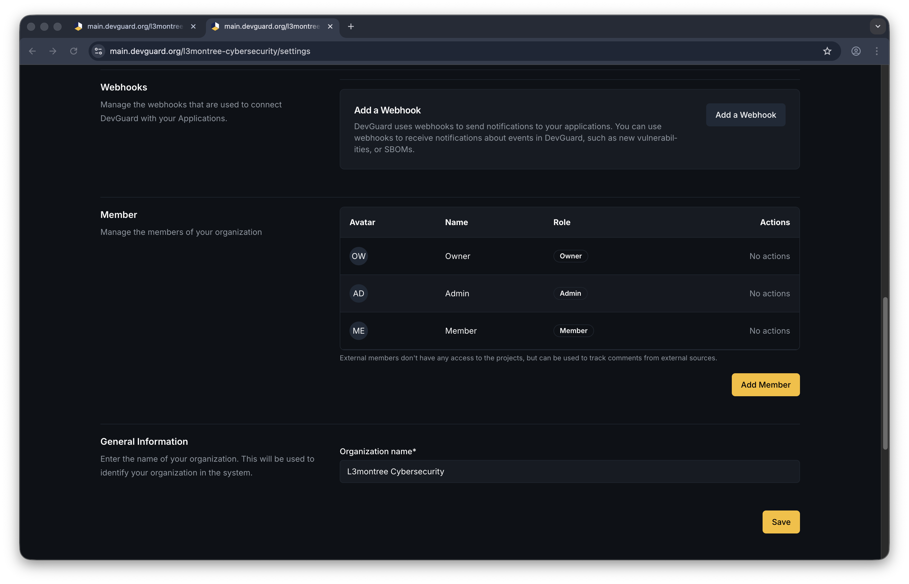
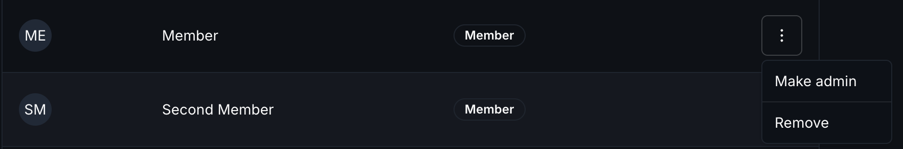

import { Callout, Tabs } from 'nextra/components'

# Manage Users and Members

Control who has access to your DevGuard organization, projects, and assets by managing team members and their roles.

## Prerequisites

Before you begin, ensure you have:

- Owner or Admin role at the level you're managing
- Access to organization/project/asset settings
- User email addresses to invite

## User Roles

DevGuard uses two primary roles:

| Role | Description | Permissions |
|------|-------------|------------|
| **Admin** | Full administrative access | Create/edit/delete, manage members, change settings, access all data |
| **Member** | Standard team member access | View vulnerabilities, create events, manage within assigned scope |
| **External** | GitHub/GitLab integrated user | Limited read-only access, no direct management capabilities |

## Manage Members

Add and remove members at the organization level:

You can manage Members on each Hierarchy Level: **Organization**, **Group**, and **Repository** -> **Settings**

1. Enter the user's email address
2. Select role:
   - **Admin** - Full organizational control
   - **Member** - Standard team access




The user receives an invitation and can accept to gain access.


### Manage Member 

Click the three-dot menu (**⋯**) on the right



The user loses all access to the organization and its projects.


<Callout type="info">
  Project members must be organization members first. Adding a non-member requires inviting them to the organization.
</Callout>


## Access Control Hierarchy

Access follows this hierarchy:

```
Organization Level
├── Admin: Full control of org, all projects, all assets
└── Member: Can access allowed projects/assets
    ├── Project Level
    │   ├── Admin: Full control of project and assets
    │   └── Member: Can access allowed assets
    │       └── Asset Level
    │           ├── Admin: Full asset control
    │           └── Member: Standard asset access
```

**Key Points:**
- Granting Admin at a higher level automatically includes lower levels
- Revoking Member status at any level removes all sub-level access
- External members (from GitHub/GitLab) have read-only access


- [Create and Manage API Tokens](./api-tokens.mdx) - Generate tokens for API access
- [Configure Webhooks](../../integrations/custom-webhooks/create-webhook.mdx) - Automate integrations
- [Setup GitHub App](../../integrations/github/setup-github-app.mdx) - GitHub integration
