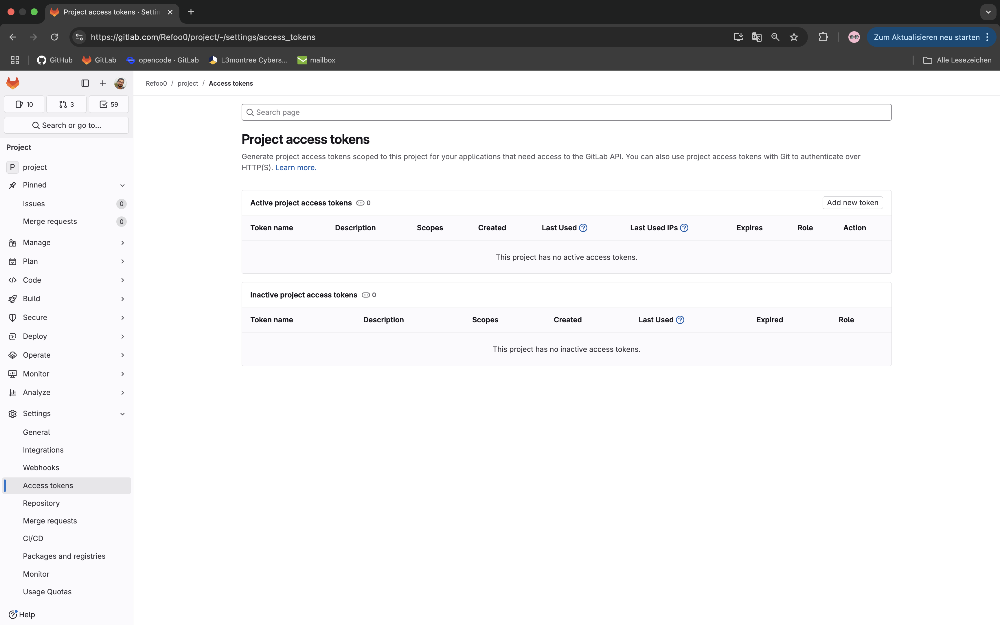
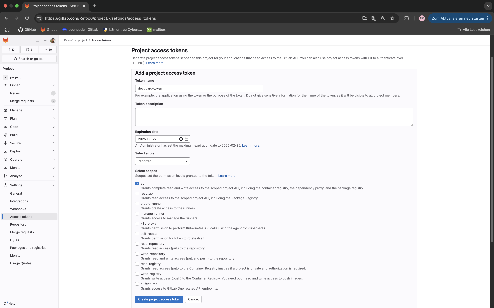
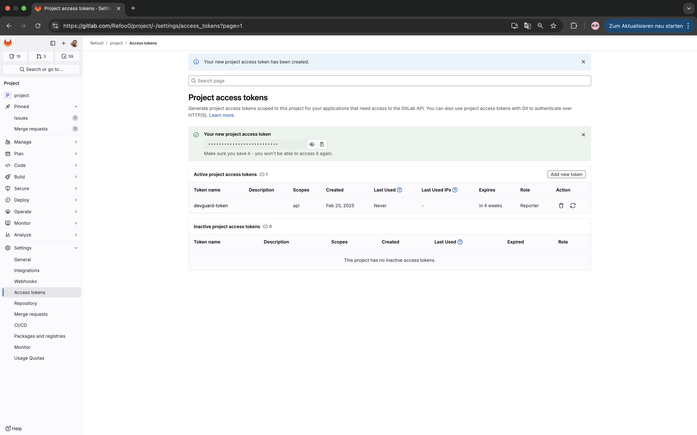
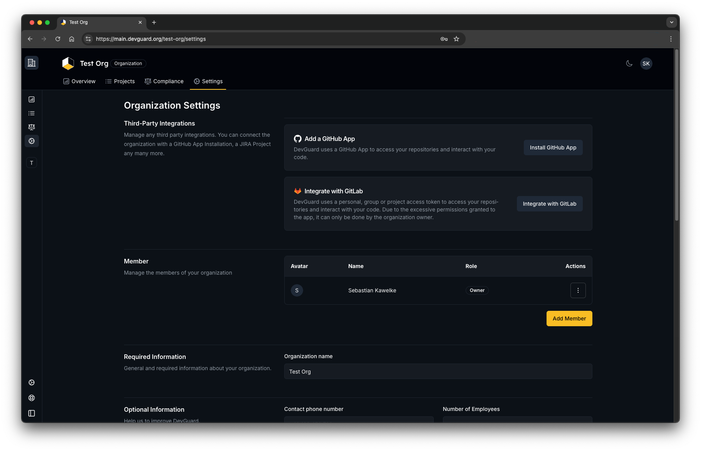
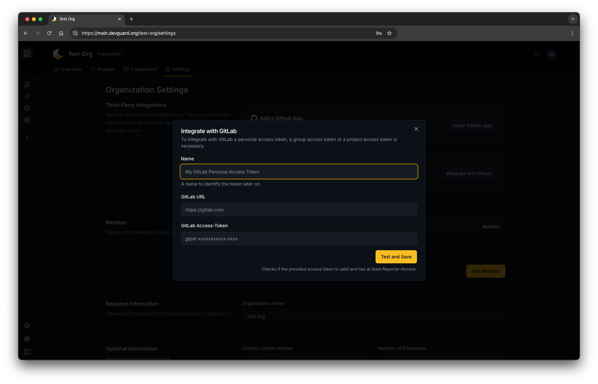
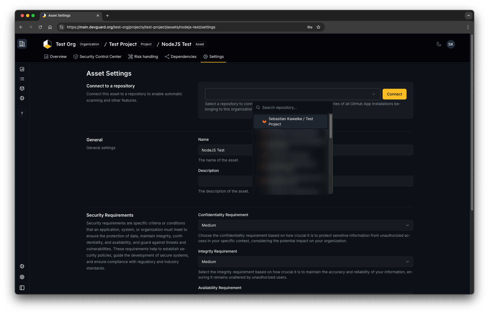
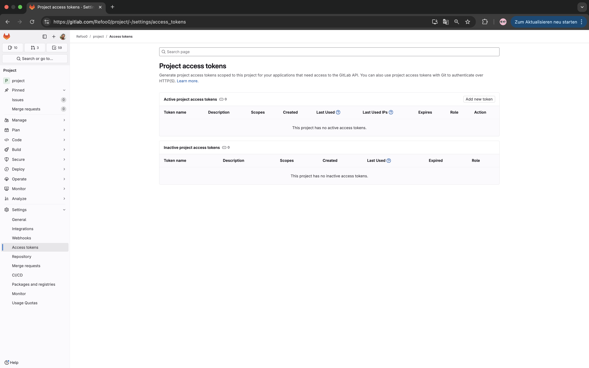
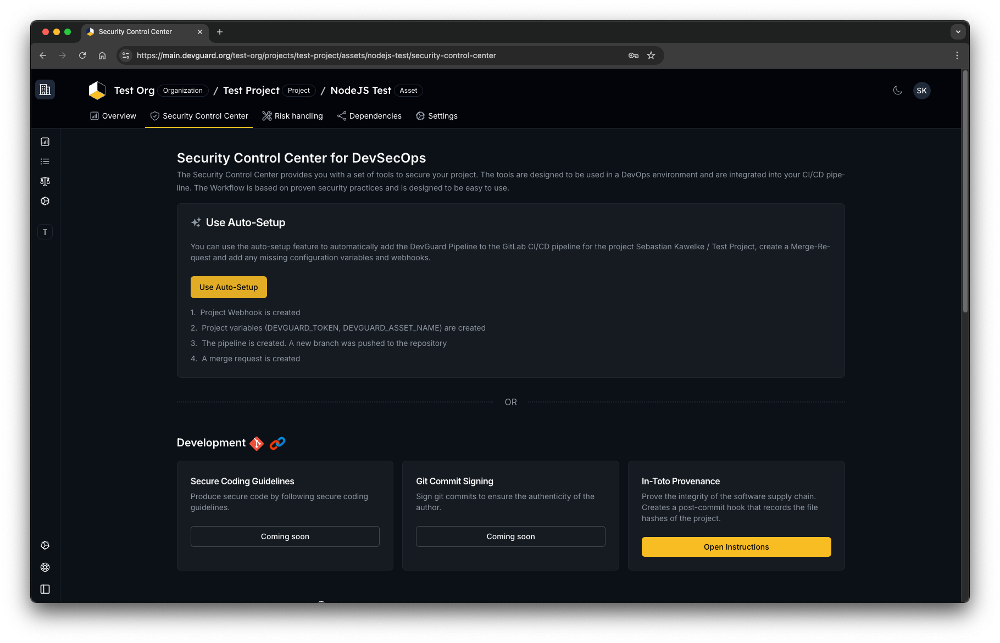

import { Steps, ImageZoom } from 'nextra/components'

# Set-up GitLab Integration

DevGuard integrates with GitLab to provide a seamless experience for developers. This guide will walk you through the steps to set up the integration.

## Steps

<Steps>

### Generate a new access token on GitLab
 
       Go to Project you want to integrate with Devguard on GitLab.  
      Choose Access tokens under Settings then click on `Add new token`.

    

    ### Configure your GitLab access token 
    Input a name and a description for the token.
     Under `Select a role` choose `Reporter`, you don't need to select any scope.
    Then click on Create project access token.
    

    ### Copy the generated token

    


### Go to organization settings on Devguard & click integrate with GitLab




### Configure your GitLab instance settings 

Add a name for the Integration (like Tom's Personal Access Token, or Project Access Token for DevGuard), the URL of your GitLab instance and the access token you generated in the previous step.



### Navigate to an asset within one of your projects and select your corresponding GitLab project.



    ### Add a webhook to your GitLab project
    Go to your GitLab project settings
    select Webhooks under Settings, then click on Add new webhook.

    

    ### Configure your GitLab webhook

    Paste following URL in the URL field: 

    if you are using devguard under stage.devguard.org
    ```sh copy 
    https://api.stage.devguard.org/api/v1/webhook/
    ```

    if you are using devguard under main.devguard.org
    ```sh copy
    https://api.devguard.org/api/v1/webhook/
    ```
    then select the events you want to trigger the webhook, it is recommended to select following events:

    - Comments
    - Issues events

    then click on Save changes


### Add a pipeline configuration
If you don’t have a .gitab-ci.yml file, create one by adding a new file in the root directory of your repository. The file should be located in the `.gitlab-ci.yml` directory and have a `.yml` extension. 

You can now add devguard components to your pipeline configuration file.
You can find more information about the pipeline configuration file [here](/reference/gitlab-components/full).


Finally, push the changes to your repository.


{/* ### Go to the security control center of the asset and click on auto setup to create a pipeline

 */}

</Steps>


Now you have successfully integrated your GitLab repository with DevGuard. You can integrate the CI/CD pipeline with DevGuard from the security control center of the asset in DevGuard. 