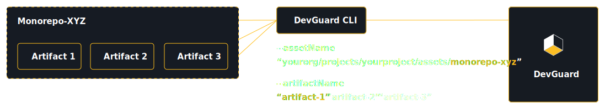

# Mapping Several Assets and Artifacts to DevGuard (Monorepos)

This guide provides an overview of how to map multiple assets and artifacts to DevGuard, particularly in the context of monorepos. 
It covers the necessary steps and considerations for effective integration.



The DevGuard Scanner CLI is designed to handle multiple assets and artifacts, making it suitable for complex projects like monorepos.

There are two flags available for this purpose:

- `--assetName`: This flag defines the name of your main asset you may have several artifacts for. An asset isreferredd to as a "Repository" in the DevGuard UI.
- `--artifactName`: This flag defines the name of your artifact, which is a specific component or module within your asset. This can be, for example, a package in a monorepo or several OCI images that are part of the same asset.

With these two options, you can map multiple artifacts to a single asset, allowing you to manage and monitor them effectively within DevGuard, as well as map your different artifacts to different assets.

## 📌 Example
Let’s say your monorepo contains three packages:

```
packages/
├── ui-lib
├── api-core
├── auth-service
```
Your CLI commands would look like:

```bash
devguard-scanner <command> \
  --assetName=yourorg/projects/yourproject/assets/my-monorepo \
  --artifactName=ui-lib
  ...

devguard-scanner <command> \
  --assetName=yourorg/projects/yourproject/assets/my-monorepo \
  --artifactName=api-core
  ...

devguard-scanner <command> \
  --assetName=yourorg/projects/yourproject/assets/my-monorepo \
  --artifactName=auth-service
  ...
```
This creates a 1 asset ➡️ 3 artifacts mapping.
