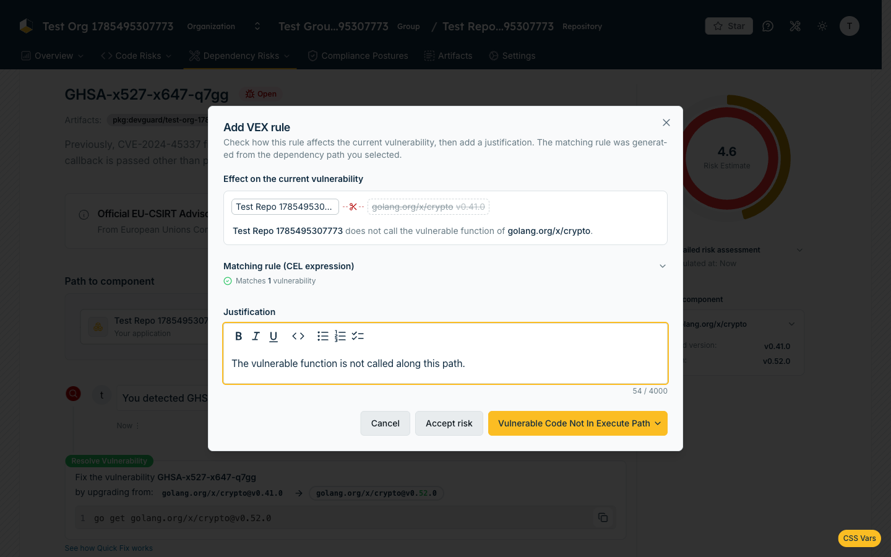
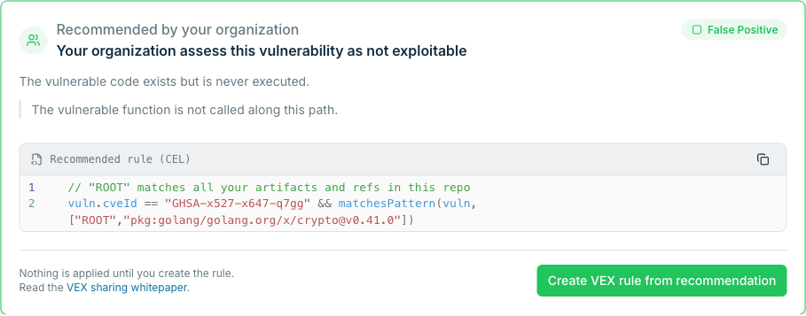
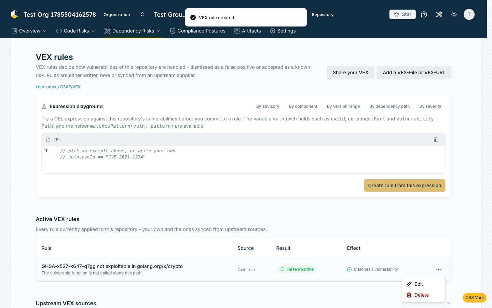

import { Callout } from '@document-writing-tools/kernux-theme'

# Create & Manage VEX Rules

A **VEX rule** automates a VEX decision for a repository. Instead of assessing vulnerabilities one at a
time, you write a [CEL](/how-to-guides/vex/cel-reference) expression that matches a set of dependency
vulnerabilities, and DevGuard applies your decision to every match — immediately, and to every future
finding that matches the same expression.

## What a rule consists of

A rule is always scoped to a single repository.

| Field | Required | Notes |
|---|---|---|
| **Title** | yes | Short, human-readable name |
| **CEL expression** | yes | Must be syntactically valid; checked live as you type |
| **Justification** | yes | Markdown, **maximum 4000 characters** |
| **Effect** | yes | **Accept risk** or **False positive** |
| **Mechanical justification** | only for false positives | One of [five standardized reasons](/how-to-guides/vex/mechanical-justifications) |

A rule's identity is derived from **(repository, CEL expression, source)**. Two consequences follow, and both
matter in practice:

- Importing the same VEX statement twice creates no duplicate.
- Changing the expression produces a *different* rule. The UI handles this for you (see
  [Edit a rule](#edit-a-rule)), but this is why the button is labelled *recreate*.

## Create a rule from the playground

The playground is the fastest way to build a rule from scratch, because it tells you how many
vulnerabilities an expression matches before you commit to it.

1. Navigate to **Dependency Risks → VEX Rules**.
2. In the **Expression playground** card, either click one of the example buttons — `By advisory`,
   `By component`, `By version range`, `By dependency path`, `By severity` — or write your own expression.
3. Watch the status line below the editor. After a short pause it reports **Matches N vulnerabilities**, or
   the syntax error if the expression is malformed.
4. Click **Create rule from this expression**.
5. In the **Add VEX rule** dialog, fill in **Title** and **Justification**.
6. Choose the effect:
   - **Accept risk** — the vulnerability is real, you knowingly carry the risk.
   - The **primary split button** marks matches as a false positive. Its label *is* the currently selected
     mechanical justification (default: *Vulnerable Code Not In Execute Path*). Use the chevron to pick a
     different one.

DevGuard evaluates the expression against the repository's dependency vulnerabilities right away, writes an
event on every match, and recalculates the risk aggregation.

<Callout type="info">
  The match count comes from a cached list of open vulnerabilities that is refreshed roughly every two
  minutes, so a count may briefly lag behind a fresh scan.
</Callout>

## Create a rule from a vulnerability

Open any dependency vulnerability under **Dependency Risks**. Three entry points lead to a rule.

### From the dependency path graph

The **Path to component** graph renders the chain from your repository down to the vulnerable package. Every
edge is labelled **calls vulnerable function** — an assumption, not a measurement. If you know an edge does
*not* hold, click it.

DevGuard then opens the dialog pre-filled with:

- a title such as `CVE-2021-1234 not exploitable in brace-expansion`
- an expression that pins the CVE **and** the dependency path, so it dismisses every finding that arrives
  through that same path — not just the one in front of you:

```javascript
// "*" matches any dependencies above web
vuln.cveId == "CVE-2021-1234" && matchesPattern(vuln, ["*","pkg:npm/web@1.0.0","pkg:npm/brace-expansion@1.1.11"])
```

When you click the very first edge — the one leaving your application — DevGuard uses the `ROOT` token
instead of `*`, which anchors the rule to all artifacts and branches of the repository:

```javascript
// "ROOT" matches all your artifacts and refs in this repo
vuln.cveId == "CVE-2021-1234" && matchesPattern(vuln, ["ROOT","pkg:npm/web@1.0.0","pkg:npm/brace-expansion@1.1.11"])
```

The dialog shows an **Effect on the current vulnerability** card: the path as chips, with a scissors icon
where your rule severs it, and everything below the cut struck through. Use it to confirm the rule does what
you intend before saving.



<Callout type="info">
  Edges are only clickable while the vulnerability is **open**. If more than 12 paths lead to the same
  vulnerability, the graph is hidden for performance reasons — assess the finding with the buttons below it
  instead, or write a rule in the playground.
</Callout>

### From a crowdsourced VEX recommendation

If other DevGuard organizations have already written the same rule — same CEL expression, same effect — for
this vulnerability, a green card appears: **Others assess this vulnerability as not exploitable**. It shows
an aggregated justification, the recommended expression, and a `Verified` badge when the supporting evidence
is strong. **Create VEX rule from recommendation** pre-fills everything.

DevGuard scores every matching organization's rule by an organization trust score (age, verification status,
prior contributions) and diminishes repeat votes from the same creator, so one account spamming identical
rules across many organizations cannot manufacture a recommendation. A recommendation only surfaces once
enough independent organizations clear that bar; the `Verified` badge marks the strongest ones.

Nothing is applied until you create the rule yourself — a recommendation is a suggestion pooled from other
organizations' own decisions, never an automatic one. See
[Mitigation Strategies](/explanations/vulnerability-management/mitigation-strategies) for how these
recommendations are derived.




### From the assessment bar

The **Create VEX Rule** button (keyboard: `⌘R`) opens the dialog with an empty expression, for when you want
to write the match condition yourself.

## Edit a rule

Click any row in the **Active VEX rules** table to open the details dialog, change the title, expression or
justification, then click **Update VEX rule (recreate)**.

Because rule identity includes the expression, DevGuard implements this as delete-then-create. Two things
follow:

- Editing a **synced** rule turns it into your own rule; it is no longer tied to the upstream source.
- If the recreation fails, DevGuard restores the previous rule and tells you so.

## Read the rules table

| Column | Shows |
|---|---|
| **Rule** | Title (or the CVE id, or `Untitled rule`) plus a truncated justification |
| **Source** | `Own rule` for rules you wrote, or a `Synced` badge with the upstream URL on hover |
| **Result** | `Accepted` or `False Positive`; the raw mechanical justification appears on hover |
| **Effect** | How many vulnerabilities this rule currently handles |

A finding handled by a rule shows a **Handled by a VEX rule** card with the matching expression, and its
assessment controls are locked: *A VEX rule is handling this vulnerability, so it's locked. To reopen it,
delete the VEX rule — you can still comment.*

## Delete a rule

Either use the `…` menu in the rules table, or the **Delete rule** button in the details dialog, then
confirm.

When a rule is deleted, DevGuard walks each affected vulnerability's history backwards and restores the last
state before the rule was applied. If there was no previous state, the vulnerability reopens.





<Callout type="info">
  There is no on/off switch for rules. A rule is either present or deleted.
</Callout>

## Related Documentation

- [CEL Expression Reference](/how-to-guides/vex/cel-reference) — every available field, function and token
- [Choose a Mechanical Justification](/how-to-guides/vex/mechanical-justifications) — which of the five reasons applies
- [Import VEX from Files & Suppliers](/how-to-guides/vex/import-vex) — rules created from uploads and upstream sources
- [Prove a Finding Is Not Exploitable](/how-to-guides/vex/prove-not-affected) — evidence for a false-positive claim
- [Create Vulnerability Events](/how-to-guides/vulnerability-management/create-vuln-events) — the manual, single-finding equivalent
- [VEX Rules API](/reference/api/vexrules) — the same operations over REST
