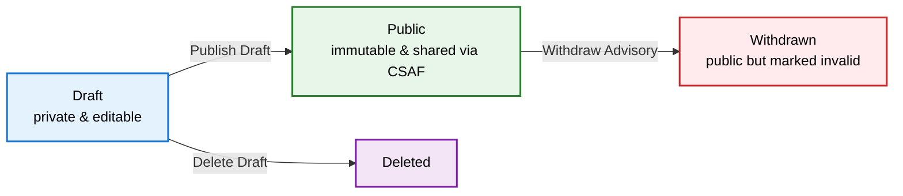
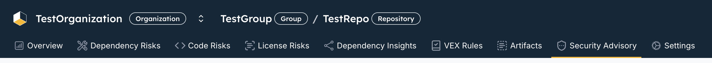
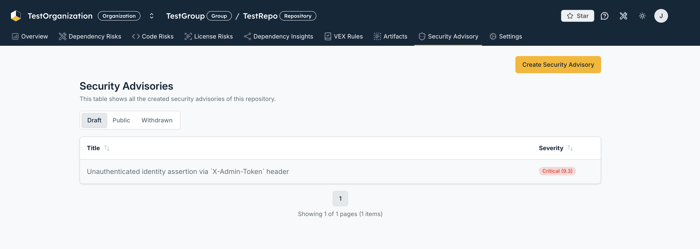
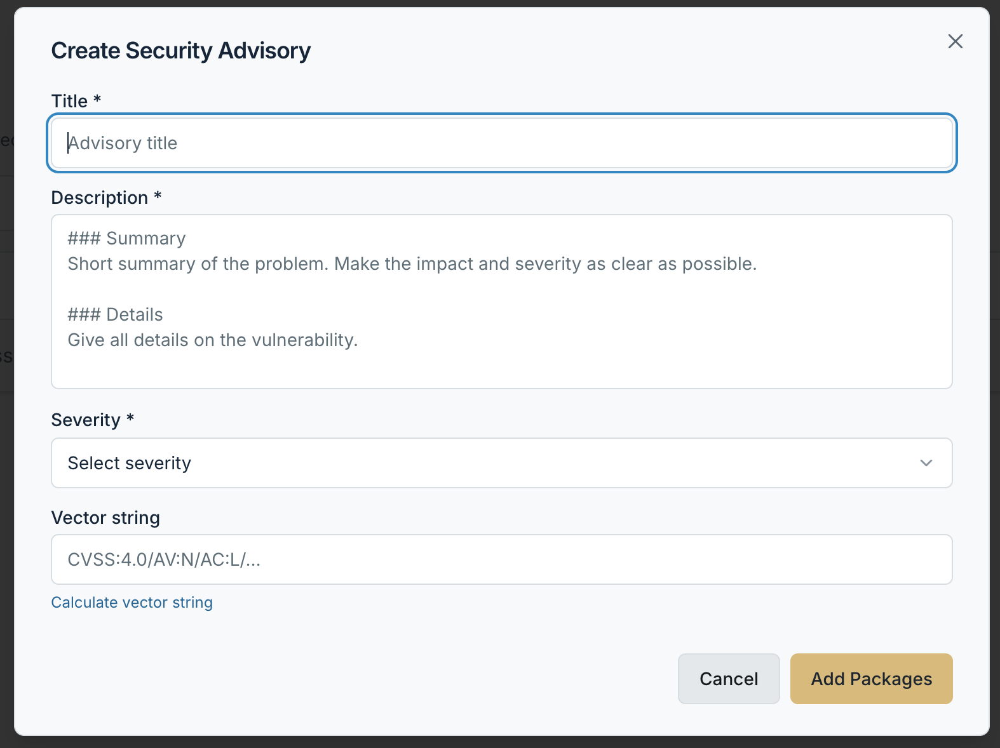
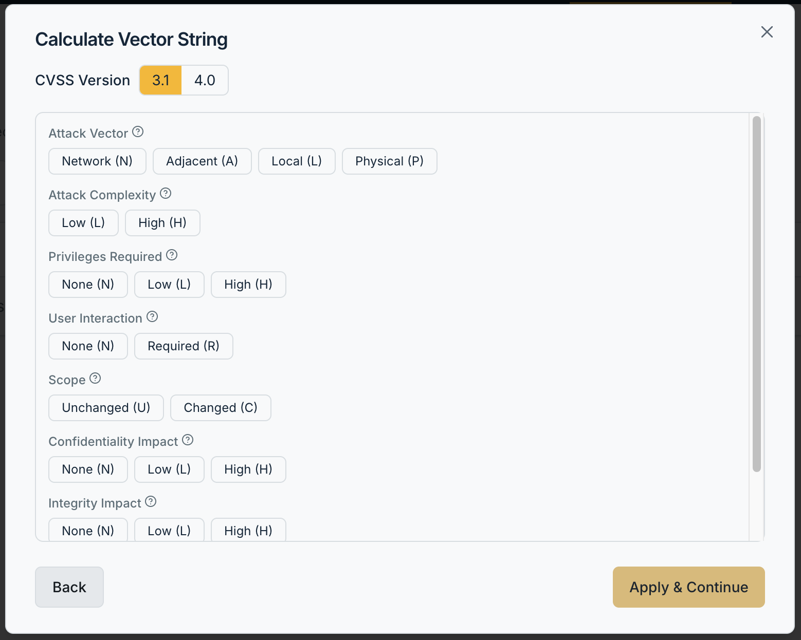
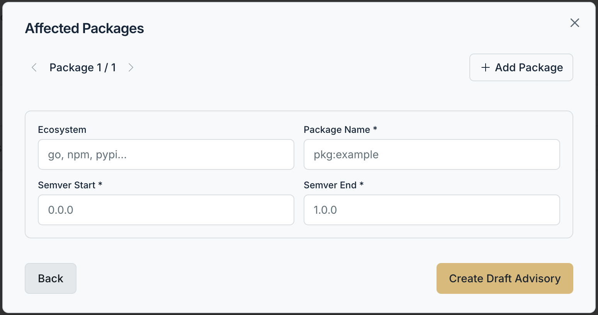
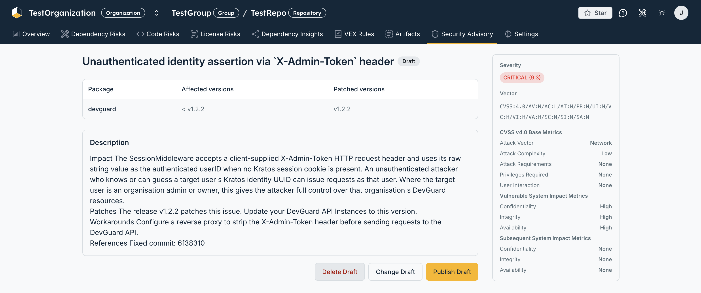

import { Callout } from '@document-writing-tools/kernux-theme'

# Create and Publish a Security Advisory

A **security advisory** in DevGuard lets you author, score and publish your *own* vulnerability reports for a repository. Unlike the VEX documents DevGuard generates automatically from scanner findings, a security advisory is written by a human — it is the vendor statement you issue when *your* software is affected by a vulnerability and you want to communicate it to your users in a standardized way.

Every advisory you publish is served through DevGuard's [CSAF](/how-to-guides/vulnerability-management/csaf-common-security-advisory-framework) provider tree, so downstream consumers receive it in the same machine-readable format as any other advisory in the ecosystem.

## Prerequisites

Before you create a security advisory, make sure you have:

- **A repository (asset) with at least one ref**: Advisories are scoped to a specific repository. The menu entry only appears once a ref exists.
- **Admin permissions**: Only organization or repository admins can create, edit, publish, withdraw or delete an advisory. Everyone with read access can view published advisories.
- **The vulnerability details at hand**: A title and description, the affected package(s) with their affected and patched version ranges, and — ideally — a CVSS vector for scoring.
- **Public vulnerability data enabled** (for publishing): To distribute advisories through the CSAF feed, the repository must have vulnerability sharing turned on. See [CSAF in DevGuard](/how-to-guides/vulnerability-management/csaf-common-security-advisory-framework#enabling-csaf-reports).

## When to Use a Security Advisory

DevGuard produces two kinds of vulnerability statements. Understanding the difference helps you pick the right tool:

| | Auto-generated VEX | Security advisory |
|---|---|---|
| **Source** | Derived from detected dependency vulnerabilities | Manually authored by you |
| **Answers** | "Am I affected by *someone else's* CVE?" | "*My* product has a vulnerability — here it is" |
| **Content** | Product status per detected CVE | Title, description, CVSS, affected packages |
| **Identifier** | The upstream CVE ID | A DevGuard ID `DGSA-<year>-<id>` |
| **Published as** | `csaf_vex` document | `csaf_security_advisory` document |

Both are published side by side through the same CSAF endpoints, giving consumers one unified feed that covers machine-detected CVEs *and* your human-authored advisories.

<Callout type="info">
  Use a security advisory when you are the maintainer/vendor of the affected component and need to disclose a vulnerability in *your* release. Use the automatic VEX flow to communicate how *upstream* CVEs affect your product.
</Callout>

## The Security Advisory Lifecycle

A security advisory moves through three visibility states. It always starts as a private **draft** that you can freely edit, and once it is correct you publish it. A published advisory is public and immutable — if it later needs to be revoked you withdraw it, which keeps it visible but marks it as no longer valid.

| State | Meaning | Available actions |
|-------|---------|-------------------|
| **Draft** | Private, only visible inside DevGuard, fully editable | Change, Publish, Delete |
| **Public** | Published to the CSAF feed, no longer editable | Withdraw |
| **Withdrawn** | Stays public but is flagged as revoked and locked | — |

## Where to Find Security Advisories

Navigate to your repository and open the **Security Advisory** entry in the asset side menu (shield icon). It sits alongside the risk views (Dependency Risks, Code Risks, License Risks) and the Artifacts view.

This opens the advisory list for the current repository and ref. The list is organized into **Draft**, **Public** and **Withdrawn** tabs, and — as an admin — you get a **Create Security Advisory** button in the top-right corner. Each row shows the advisory title and its CVSS severity.

## Create a Security Advisory

Click **Create Security Advisory** to open the creation dialog. The dialog guides you through three steps.

### Step 1 — Describe the vulnerability

On the first step you enter the core metadata of the advisory:

- **Title** *(required)* — a concise summary of the issue.
- **Description** *(required)* — the full write-up in Markdown. A `### Summary` / `### Details` structure works well.
- **Severity** *(required)* — one of *Critical, High, Medium, Low, None*. This field is filled automatically and locked when you provide a CVSS vector string.
- **Vector string** — the CVSS vector (for example `CVSS:4.0/AV:N/AC:L/...`). If you don't know it by heart, use the built-in calculator in the next step.

### Step 2 — Calculate the CVSS vector (optional)

If you need help scoring the vulnerability, open the **Calculate vector string** helper. You can switch between **CVSS 3.1** and **CVSS 4.0**, pick a value for each metric, and DevGuard shows the resulting base score and severity live. Applying the calculation writes the vector back into the form and derives the severity automatically.

### Step 3 — Add the affected packages

Finally, list the packages affected by the advisory (up to ten). For each package you provide:

- **Ecosystem** — for example `go`, `npm` or `pypi`.
- **Package name** — the package identifier.
- **Affected versions** — the version where the vulnerability was introduced.
- **Patched version** — the version that fixes it.

DevGuard turns these into standardized version ranges (`vers:` notation) in the published document and adds a *vendor fix* remediation pointing at the patched version.

Click **Create Draft Advisory** to save. The new advisory appears under the **Draft** tab.

## Manage, Publish and Withdraw

Open an advisory from the list to reach its detail page. It shows the rendered description, the affected-package table (with affected and patched version columns) and a sidebar with the severity, the CVSS vector and the individual base metrics.

The available actions depend on the current state.

### Draft actions

A draft shows a **Draft** badge and three admin actions:

- **Change Draft** — reopens the dialog prefilled so you can edit any field.
- **Publish Draft** — makes the advisory public. After confirmation it is served through the CSAF feed and can no longer be edited.
- **Delete Draft** — permanently removes the draft.

<Callout type="warning">
  Publishing is irreversible in the sense that a public advisory can no longer be edited — you can only **withdraw** it. Double-check the title, description, severity and affected packages before you confirm.
</Callout>

Every state change asks for confirmation so you don't publish or withdraw an advisory by accident.

### Published and withdrawn advisories

A published advisory carries a green **Published** badge and offers a single action, **Withdraw Advisory**. Withdrawing keeps the advisory publicly reachable — so anyone who already referenced it still finds it — but marks it as withdrawn and locks it against further changes.

## How the Advisory Is Published

When you publish an advisory, DevGuard exposes it through the organization's CSAF provider tree — the same one that carries the automatically generated VEX documents. Concretely:

- The advisory receives a DevGuard identifier of the form **`DGSA-<year>-<id>`** (DevGuard Security Advisory).
- It is rendered on the fly as a canonical **`csaf_security_advisory`** JSON document at TLP:WHITE, with a product tree built from your affected packages, `known_affected` product statuses and a `vendor_fix` remediation for the patched version.
- It is listed next to the CVE-based documents in the CSAF `index.txt`, the `changes.csv` and the per-year index — so consumers discover it automatically.
- Like any CSAF document it can be fetched as plain JSON or with an OpenPGP signature (`.asc`) and checksums (`.sha256` / `.sha512`).

For the full endpoint structure, aggregator and provider-metadata details, see [CSAF in DevGuard](/how-to-guides/vulnerability-management/csaf-common-security-advisory-framework#accessing-csaf-data).

## Related Documentation

- [CSAF in DevGuard](/how-to-guides/vulnerability-management/csaf-common-security-advisory-framework) — how advisories are distributed and consumed
- [Sync External Upstream Data](/how-to-guides/vulnerability-management/sync-external-data) — ingest VEX and advisories from other providers
- [Track Fix Progress](/how-to-guides/vulnerability-management/track-fix-progress) — monitor remediation of detected vulnerabilities
- [Customize Risk Scores](/how-to-guides/vulnerability-management/customize-risk-scores) — adjust risk based on your context
