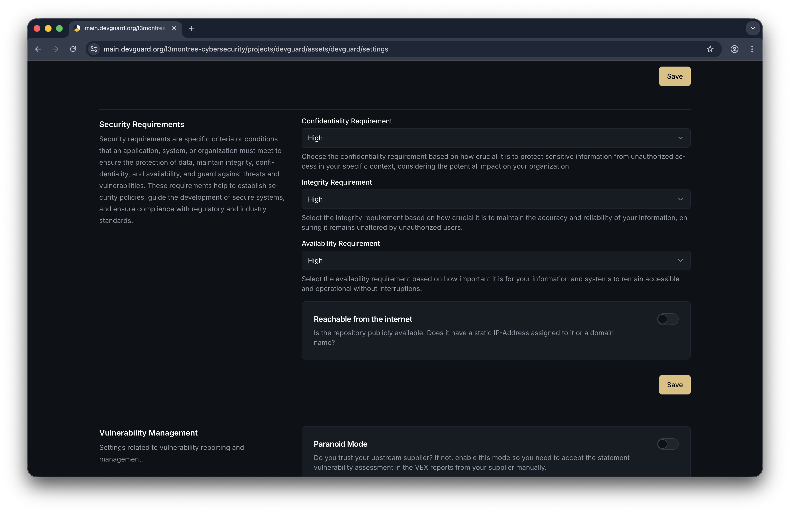
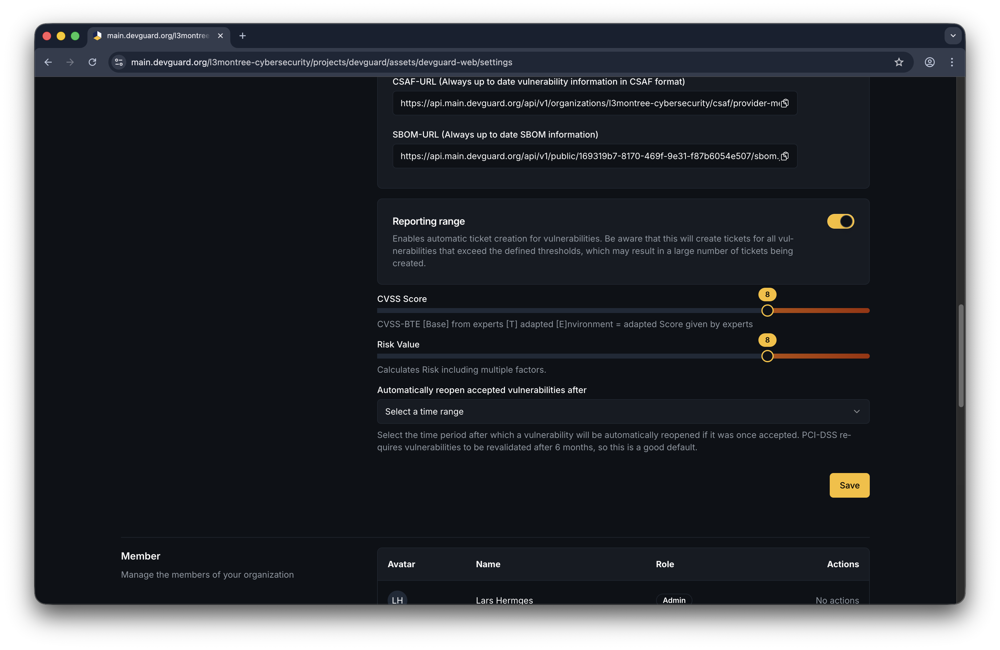
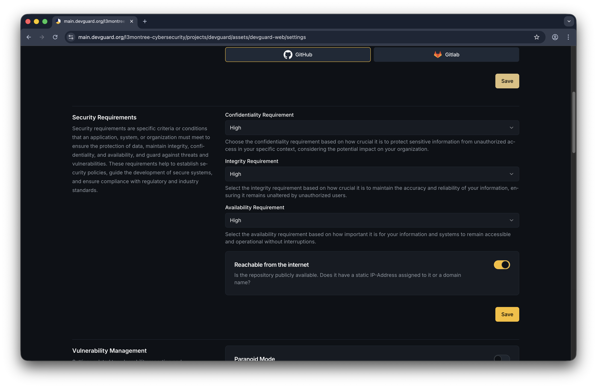
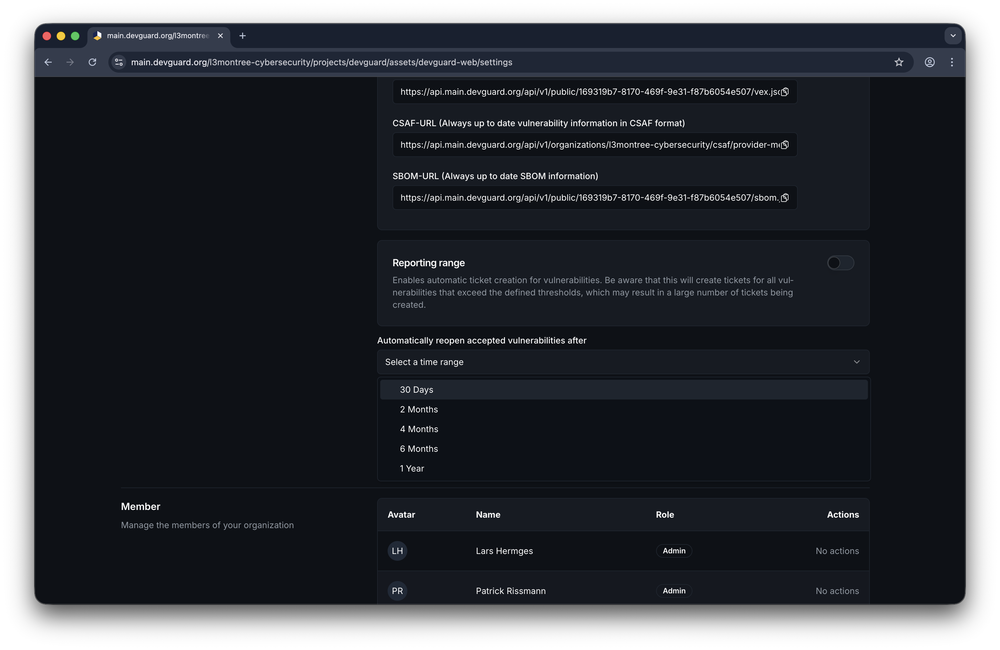

import { Callout, Tabs } from 'nextra/components'

# Customize Risk Scores

Tailor vulnerability risk assessments to your asset's specific operational context. DevGuard uses CIA (Confidentiality, Integrity, Availability) environmental requirements to adjust CVSS scores and automatically create tickets based on risk thresholds.

## Prerequisites

Before you begin, ensure you have:

- Access to a DevGuard organization and project
- An asset (application/service) created in DevGuard
- Owner or admin role for the asset
- Understanding of your application's CIA requirements

## Understanding CIA Requirements

CIA requirements represent the potential impact if a vulnerability is exploited:

### Confidentiality Requirement
**How sensitive is your data if exposed?**
- **Low**: Data exposure has minimal impact (public information, non-sensitive logs)
- **Medium**: Data exposure has moderate impact (internal company info, non-critical user data)
- **High**: Data exposure is severely damaging (personal data, financial records, trade secrets)

### Integrity Requirement
**How critical is data accuracy and consistency?**
- **Low**: Data modification has minimal impact (cosmetic UI data, non-critical caches)
- **Medium**: Data modification has moderate impact (user preferences, operational logs)
- **High**: Data modification is severely damaging (financial transactions, medical records, authentication data)

### Availability Requirement
**How critical is service availability?**
- **Low**: Service downtime has minimal impact (non-critical internal tools)
- **Medium**: Service downtime has moderate impact (non-critical customer features)
- **High**: Service downtime is severely damaging (payment systems, emergency services, core business functions)

## Customize Risk Scores

### Access Asset Settings

1. Navigate to your DevGuard instance
2. Select your **Organization** → **Project** → **Asset**
3. Click the **Settings** tab in the asset details page

### Set CIA Requirements

<Tabs items={['Web UI', 'API']}>
  <Tabs.Tab>
    In the Asset Settings page under **Requirements**:

    


    1. **Set Confidentiality Requirement**
       - Select: Low, Medium, or High
       - Default: High

    2. **Set Integrity Requirement**
       - Select: Low, Medium, or High
       - Default: High

    3. **Set Availability Requirement**
       - Select: Low, Medium, or High
       - Default: High

    4. **Save Changes**
       - Click the **Save** button at the bottom of the form

    <Callout type="info">
      CIA requirements are automatically applied to all existing and future vulnerability assessments for this asset. Risk scores are recalculated immediately.
    </Callout>
  </Tabs.Tab>

  <Tabs.Tab>
    Update CIA requirements via API:

    ```bash copy
    curl -X PATCH \
      "https://api.devguard.org/api/v1/organizations/{organizationId}/projects/{projectId}/assets/{assetId}" \
      -H "Authorization: Bearer YOUR_TOKEN" \
      -H "Content-Type: application/json" \
      -d '{
        "confidentialityRequirement": "high",
        "integrityRequirement": "high",
        "availabilityRequirement": "low"
      }'
    ```

    **Request Body Parameters:**
    - `confidentialityRequirement`: "low" | "medium" | "high"
    - `integrityRequirement`: "low" | "medium" | "high"
    - `availabilityRequirement`: "low" | "medium" | "high"
  </Tabs.Tab>
</Tabs>

## Configure Automatic Ticket Creation

Control when vulnerabilities automatically create tickets based on risk scores:

### Enable Risk-Based Ticket Thresholds

<Tabs items={['Web UI', 'API']}>
  <Tabs.Tab>
    In Asset Settings under **Vulnerability Management**:
    

    1. **Enable Reporting Range**
       - Toggle the switch to enable automatic ticket creation thresholds

    2. **Set CVSS Threshold**
       - Slider range: 0-10 (0.5 increments)
       - Default: 8.0
       - Tickets auto-create for vulnerabilities with CVSS ≥ this value

    3. **Set Risk Threshold**
       - Slider range: 0-10 (0.5 increments)
       - Default: 8.0
       - Tickets auto-create for vulnerabilities with environmental risk score ≥ this value

    4. **Save Changes**
       - Changes apply immediately to new vulnerabilities

    <Callout type="info">
      The **Risk Threshold** considers your CIA requirements, while the **CVSS Threshold** uses the base CVSS score without environmental adjustments.
    </Callout>
  </Tabs.Tab>

  <Tabs.Tab>
    Configure thresholds via API:

    ```bash copy
    curl -X PATCH \
      "https://api.devguard.org/api/v1/organizations/{organizationId}/projects/{projectId}/assets/{assetId}" \
      -H "Authorization: Bearer YOUR_TOKEN" \
      -H "Content-Type: application/json" \
      -d '{
        "enableTicketRange": true,
        "cvssAutomaticTicketThreshold": 8.0,
        "riskAutomaticTicketThreshold": 7.5
      }'
    ```

    **Request Body Parameters:**
    - `enableTicketRange`: boolean (enable/disable automatic tickets)
    - `cvssAutomaticTicketThreshold`: number (0-10, step 0.5)
    - `riskAutomaticTicketThreshold`: number (0-10, step 0.5)
  </Tabs.Tab>
</Tabs>

## Additional Risk Context Settings

### Network Exposure

Indicate whether your asset is reachable from the internet:

<Tabs items={['Web UI', 'API']}>
  <Tabs.Tab>

      

    In Asset Settings, toggle **Reachable from Internet** to inform DevGuard of your asset's network exposure. This helps contextualize risk assessments.
  </Tabs.Tab>

  <Tabs.Tab>
    ```bash copy
    curl -X PATCH \
      "https://api.devguard.org/api/v1/organizations/{organizationId}/projects/{projectId}/assets/{assetId}" \
      -H "Authorization: Bearer YOUR_TOKEN" \
      -H "Content-Type: application/json" \
      -d '{
        "reachableFromInternet": true
      }'
    ```
  </Tabs.Tab>
</Tabs>

### Vulnerability Auto-Reopen

Automatically reopen accepted vulnerabilities after a specified period to re-evaluate fixes:

<Tabs items={['Web UI', 'API']}>
  <Tabs.Tab>
    

    In Asset Settings under **Vulnerability Management**:
    - Select auto-reopen period: 30, 60, 120, 180, or 360 days
    - When enabled, accepted vulnerabilities automatically reopen after the specified period for re-assessment
  </Tabs.Tab>

  <Tabs.Tab>
    Currently configured through the Web UI. The system will reopen vulnerabilities based on the configured period.
  </Tabs.Tab>
</Tabs>

## How Risk Scores Are Calculated

DevGuard adjusts CVSS scores based on your CIA requirements using the **CVSS Environmental Score** formula:

```
Environmental Score = Base CVSS Score × Environmental Factor
```

Where the Environmental Factor is derived from:
- **Confidentiality Requirement** (CR)
- **Integrity Requirement** (IR)
- **Availability Requirement** (AR)
- Threat Intel data (EPSS, Known Exploits)
- Additional DevGuard threat sources

### Score Interpretation

| Risk Score | Severity | Typical Action |
|-----------|----------|---|
| 0.0 - 3.9 | Low | Monitor, document for compliance |
| 4.0 - 6.9 | Medium | Plan remediation within 90 days |
| 7.0 - 8.9 | High | Prioritize remediation within 30 days |
| 9.0 - 10.0 | Critical | Immediate remediation required |

<Callout type="info">
  Your CIA requirements influence how CVSS scores are adjusted. A vulnerability with a CVSS of 6.0 might become 8.5 risk if your asset has High CIA requirements and the vulnerability affects those critical areas.
</Callout>

## Best Practices

### Setting Appropriate CIA Levels

<Callout type="warning">
  Do not set all requirements to "Low" to reduce alerts. This provides a false sense of security and may cause compliance violations.
</Callout>

1. **Be Honest About Impact**
   - Consider actual business impact, not wishful thinking
   - Factor in regulatory compliance requirements (PCI-DSS, HIPAA, GDPR, etc.)

2. **Review and Update Periodically**
   - Asset importance changes over time
   - Reassess CIA requirements during quarterly reviews
   - Update after major architectural changes

3. **Coordinate With Stakeholders**
   - Product/business owners should confirm data sensitivity
   - DevOps should confirm availability requirements
   - Compliance team should confirm regulatory needs

### Threshold Configuration

1. **Start Conservative**
   - Begin with default thresholds (8.0 for both CVSS and Risk)
   - Monitor ticket creation for 2-4 weeks
   - Adjust based on actual vulnerability volume and team capacity

2. **Balance Alert Fatigue**
   - Too low: Overwhelming number of tickets
   - Too high: Missing real vulnerabilities
   - Typical range: 7.0-9.0 depending on risk appetite

3. **Use Both Thresholds**
   - **CVSS Threshold**: Catches inherently critical vulnerabilities
   - **Risk Threshold**: Catches vulnerabilities critical to YOUR asset
   - Use both for comprehensive coverage

### Common Scenarios

#### E-commerce Platform
```
Confidentiality: High (customer payment data)
Integrity: High (transaction accuracy critical)
Availability: High (business revenue depends on uptime)
CVSS Threshold: 7.0
Risk Threshold: 7.0
```

#### Internal Analytics Dashboard
```
Confidentiality: Medium (aggregated company metrics)
Integrity: Medium (analysis accuracy matters but not critical)
Availability: Low (downtime affects convenience, not business)
CVSS Threshold: 8.5
Risk Threshold: 7.5
```

#### Public Blog
```
Confidentiality: Low (content is public)
Integrity: Medium (misinformation impacts reputation)
Availability: Low (short downtime acceptable)
CVSS Threshold: 9.0
Risk Threshold: 8.0
```

## Troubleshooting

### Risk Scores Don't Change After Updating CIA

**Issue**: Changed CIA requirements but risk scores didn't update

**Solution**:
1. Verify changes were saved (check Settings page again)
2. Refresh the page to see updated risk scores
3. Check the vulnerability details page - new risk score should be displayed
4. DevGuard recalculates all vulnerabilities when CIA requirements change (this may take a moment on large assets)

### Too Many Automatic Tickets Being Created

**Issue**: Thresholds are creating excessive tickets

**Solution**:
1. Review your threshold values - they may be too low
2. Consider your asset's actual risk appetite
3. Increase thresholds by 0.5 and monitor
4. Adjust CIA requirements if they don't reflect actual needs
5. Disable automatic tickets and manage manually if needed

### Tickets Not Being Created for High-Risk Vulnerabilities

**Issue**: High-severity vulnerabilities aren't creating tickets

**Solution**:
1. Verify "Reporting range" is enabled
2. Check your thresholds aren't too high
3. Confirm the vulnerability risk score meets the threshold
4. Check ticket integration is configured (GitHub Issues, GitLab Issues, Jira)
5. Review asset permissions - ensure tickets can be created

## Compliance & Standards

CIA requirements mapping supports:
- **ISO 27001**: Asset classification and risk treatment planning
- **NIST**: Confidentiality, Integrity, Availability classification
- **EU CRA**: Impact assessment and risk categorization
- **Custom Policies**: Define your own compliance rules via Rego

<Callout type="info">
  DevGuard includes built-in compliance policies that validate CIA requirements are properly configured for regulatory adherence.
</Callout>