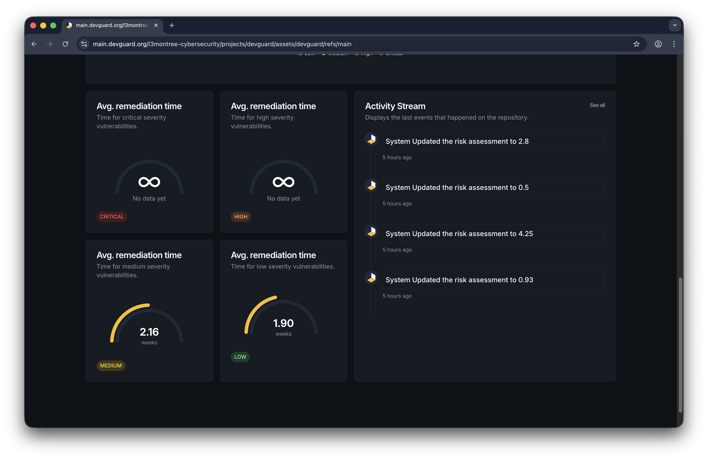
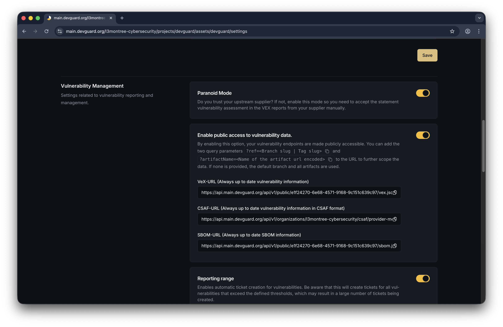

import { Tabs, TabsContent, TabsList, TabsTrigger } from '@/components/ui/tabs';
import { Callout } from 'nextra/components';

# Track Fix Progress

Monitor and manage the remediation progress of vulnerabilities throughout their lifecycle. DevGuard provides multiple ways to track how vulnerabilities move from **open** to **fixed** status, with full audit trails and evidence documentation.

## Prerequisites

Before tracking vulnerability fix progress, ensure you have:

- **Assets created and scanned**: At least one asset with vulnerability scans completed
- **Vulnerabilities detected**: Open vulnerabilities identified through SAST, SCA, IaC, or container scanning
- **Basic understanding of vulnerability states**: Familiarity with the five vulnerability states (open, fixed, accepted, false positive, marked for transfer)
- **Access to Risk Management**: Permission to view and manage vulnerabilities in your project

## Understanding Vulnerability States

Vulnerabilities follow a lifecycle with five possible states:

| State | Meaning | Trigger |
|-------|---------|---------|
| **Open** | Newly detected vulnerability requiring action | Initial scan detection |
| **Fixed** | Vulnerability resolved through remediation | Next scan detection or manual state change |
| **Accepted** | Deliberate decision to acknowledge risk without fixing | Manual risk acceptance |
| **False Positive** | Incorrectly detected vulnerability | Manual dismissal |
| **Marked for Transfer** | Vulnerability transferred to upstream maintainer | Upstream supplier responsibility |

## How Vulnerabilities Move to Fixed

DevGuard tracks fix progress through two primary mechanisms:

### 1. Automatic Detection on Next Scan

When you remediate a vulnerability (by updating dependencies, patching code, etc.) and run a new scan:

1. **Scan identifies the fix**: The vulnerability is no longer detected in your codebase
2. **Status updates automatically**: DevGuard marks it as **Fixed** in the current asset version
3. **Event recorded**: A "Fixed" event is added to the vulnerability's history with scan timestamp

This is the most reliable way to confirm fixes, as it's backed by actual scan evidence.

### 2. Manual Status Change

You can manually change a vulnerability's status for cases where automatic detection isn't possible:

1. Navigate to the vulnerability detail page
2. Click the **Change Status** or state badge
3. Select **Mark as Fixed**
4. Provide a justification explaining the fix (manual or mechanical)
5. Save the change

Manual state changes are useful for:
- **Hotfixes not yet in production**: You've fixed the code but haven't deployed
- **Dependency updates in progress**: You've updated to a patched version pending deployment
- **Mitigations applied**: You've implemented compensating controls

## Tracking Mitigation Progress

DevGuard uses a **Mitigation** model to track remediation efforts with the following key attributes:

### Overall Risk Metrics

Monitor fix progress across your project:

1. **Dashboard Overview**: View total vulnerabilities by state
   - Current open vulnerabilities
   - Fixed this month/quarter
   - Accepted or transferred items

2. **Trend Tracking**: Historical data shows:
   - Days to fix by severity level
   - Fix rate over time
   - Trend of vulnerability introduction vs. resolution

## Integration with Issue Tracking

Connect vulnerability fixes to your workflow:

### Ticket Linking

When fixing vulnerabilities, link to external issue trackers:

- **GitHub Issues**: Automatically create or link PRs with `github:org/repo#123`
- **GitLab Issues**: Track with `gitlab:group/project#456`
- **Jira**: Link to ticket `PROJ-789`

DevGuard displays ticket links on vulnerability details, enabling:
- Single-click navigation to fix PR/branch
- Automated closure when linked ticket resolves
- Tracking fix progress through issue workflow

### Resolve Vulnerabilities via Slash Commands

When DevGuard creates tickets in GitHub or GitLab, you can interact with vulnerabilities directly through issue comments using slash commands. These commands automatically update vulnerability status in DevGuard without needing to use the web UI.

**Supported Platforms:**
- GitHub Issues (comments on DevGuard-created issues)
- GitLab Issues (comments on DevGuard-created issues)

**Requirements:**
- You must have **project member permissions** in the Git platform
- Comment must be on a DevGuard-created or linked vulnerability ticket

#### Commands for Dependency Vulnerabilities

| Command | Purpose | Usage |
|---------|---------|-------|
| `/accept` | Accept the risk with justification | `/accept We accept this risk because it's internal-only` |
| `/component-not-present` | Mark as false positive: component not included | `/component-not-present This dependency isn't bundled` |
| `/vulnerable-code-not-present` | Mark as false positive: code not compiled | `/vulnerable-code-not-present Code is stripped in build` |
| `/vulnerable-code-not-in-execute-path` | Mark as false positive: code never executed | `/vulnerable-code-not-in-execute-path Feature is disabled` |
| `/vulnerable-code-cannot-be-controlled-by-adversary` | Mark as false positive: no attack vector | `/vulnerable-code-cannot-be-controlled-by-adversary Protected by WAF` |
| `/inline-mitigations-already-exist` | Mark as false positive: mitigations in place | `/inline-mitigations-already-exist Input validation applied` |
| `/reopen` | Reopen a previously closed vulnerability | `/reopen New evidence found, needs re-evaluation` |

#### Commands for Source Code Vulnerabilities (SAST)

| Command | Purpose | Usage |
|---------|---------|-------|
| `/accept` | Accept the risk with justification | `/accept False alarm, input is validated elsewhere` |
| `/false-positive` | Mark as false positive | `/false-positive This pattern is safe in our context` |
| `/reopen` | Reopen a previously closed vulnerability | `/reopen Confirmed during code review, needs fix` |

#### Examples

<Callout type="info">
  Slash commands are case-sensitive and must be the first text in your comment. Include a justification for audit trail purposes.
</Callout>

## Upstream State Synchronization

For dependencies with supplier VEX statements:

### Paranoid Mode

For heightened security posture:

- Require manual acceptance of upstream VEX statements
- Don't automatically trust supplier assessments
- Maintain independence from upstream risk assessments
- Useful for zero-trust supply chain environments

## Monitoring Fix Velocity

Track your team's remediation effectiveness:

### Key Metrics

- **Mean Time to Fix (MTTF)**: Average days from detection to resolution by severity
- **Fix Rate**: Vulnerabilities resolved per week/month
- **Backlog Trend**: Open vs. fixed over time
- **Priority Response**: Time to address critical/high severity items

- [Customize Risk Scores](/how-to-guides/vulnerability-management/customize-risk-scores) - Adjust risk based on context
- [Scan Dependencies](/how-to-guides/scanning/scan-dependencies) - Detect vulnerabilities to fix
- [Scan Source Code](/how-to-guides/scanning/scan-source-code) - Find and remediate code issues
