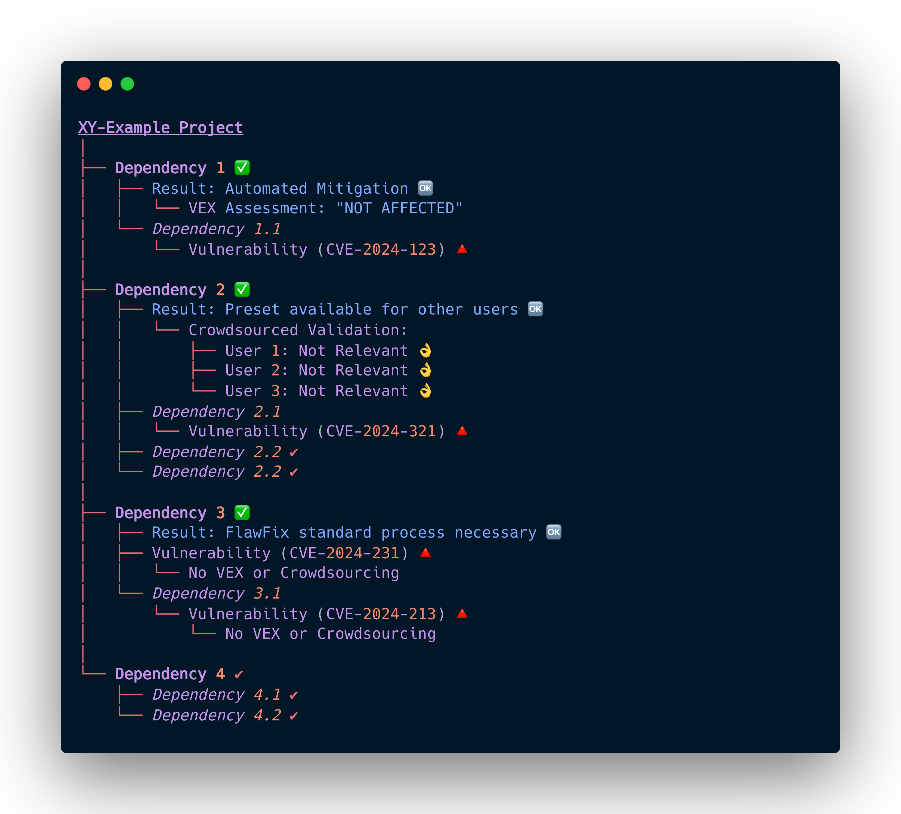

import LogoCloud from "../components/LogoCloud"

# DevGuard

## Mission

DevGuard is built by developers, for developers, aiming to simplify the complex world of vulnerability management. Our goal is to integrate security seamlessly into the software development lifecycle, ensuring that security practices are accessible and efficient for everyone, regardless of their security expertise.

### Demo

We are using DevGuard to scan and manage the risks of DevGuard itself—essentially eating our own dogfood. The project can be found here: [Public DevGuard Project](https://main.devguard.org/l3montree-cybersecurity/projects/devguard)

We believe VEX information should be shared via a link due to its dynamic nature, as what is risk-free today may be affected by a CVE tomorrow. We've integrated the DevGuard risk scoring into the metrics, with detailed documentation on its calculation to follow soon. SBOM and VEX data are always up to date at these links: 

|Project|SBOM|VeX|
|---|---|---|
|[Devguard Golang API](https://github.com/l3montree-dev/devguard)|[SBOM](https://main.devguard.org/l3montree-cybersecurity/projects/devguard/assets/devguard/sbom.json?scanType=container-scanning)|[VeX](https://main.devguard.org/l3montree-cybersecurity/projects/devguard/assets/devguard/vex.json?scanType=container-scanning)|
|[Devguard Web-Frontend](https://github.com/l3montree-dev/devguard-web)|[SBOM](https://main.devguard.org/l3montree-cybersecurity/projects/devguard/assets/devguard-web/sbom.json?scanType=container-scanning)|[VeX](https://main.devguard.org/l3montree-cybersecurity/projects/devguard/assets/devguard-web/vex.json?scanType=container-scanning)|

### The problem we solve

Identifying and managing software vulnerabilities is an increasingly critical challenge. Developers often face security issues without the proper training or tools that fit into their everyday workflows. DevGuard is a developer-centered software designed to provide simple, modern solutions for vulnerability detection and management, compliant with common security frameworks.

In 2023 alone, cyberattacks caused approximately 206 billion euros in damage only in Germany. Many of these attacks exploited software vulnerabilities. With agile and DevOps methodologies becoming standard, the need for integrating security into the development process has never been greater. We aim to fill this gap with DevGuard, offering a seamless integration of vulnerability management into development workflows.

#### Prioritizing Vulnerabilities

Not all vulnerabilities pose the same level of risk to your project. Effective prioritization of vulnerabilities is crucial to ensure that resources are focused on addressing the most critical issues. DevGuard helps you focus on what truly matters by providing risk assessments based on CVSS scores, exploit availability (ExploitDB), and real-world threat data (EPSS). This approach converts a generic `--exit-code 1 --severity CRITICAL` (like trivy has it) to a more practical `--exit-code 1 --risk CRITICAL` strategy, ensuring that you address vulnerabilities that could have the most significant impact on your software.

To further illustrate the importance of prioritizing vulnerabilities, consider our Sankey diagram, which demonstrates how many high CVSS vulnerabilities are reassessed and reprioritized. The diagram shows that a significant portion of these vulnerabilities are mapped to EPSS scores in the 0-10% range, indicating a lower likelihood of exploitation. This visual representation underscores the necessity of a nuanced approach to vulnerability management, where not all "critical" CVEs are treated equally, but rather prioritized based on their actual risk.

## Key Features

1. **Developer-Centric Integration:** DevGuard fits naturally into your existing CI/CD workflows, reducing friction and enhancing productivity. It supports the OWASP DevSecOps pipeline, offering tools (we just reuse open source tools but provide a simplified wrapper cli) for secret scanning (coming soon), SAST (coming soon), SCA, container scanning, IaC scanning (coming soon) and DAST (coming soon).
2. **Automated Security Monitoring:** Continuous monitoring using Software Bill of Materials (SBOMs) to keep your projects secure.
3. **Risk Assessment:** Automatically assesses and prioritizes risks to help you address the most critical vulnerabilities first — no really, we do this pragmatically and automate where possible! (Our base: CVSS, exploitdb, EPSS)
4. **Compliance:** Ensures your projects meet security standards like ISO/IEC 27001 and PCI-DSS.
5. **Security and confidentiality:** We prioritize the security of this software! In an expansion stage and in cooperation with research institutions, we want to make confidential data processing usable for the secure handling of sensitive information (confidential computing).

## Joint vulnerability management - the strength of exchange

Based on emerging standards such as the Vulnerability Exploitability eXchange (VEX) and our goal of increasing overall software security through the dissemination of DevGuard, we want to make expert information available from the source.  

### Vulnerability Exploitability eXchange (VEX) 

> “The goal of Vulnerability Exploitability eXchange (VEX) is to allow a software supplier or other parties to assert the status of specific vulnerabilities in a particular product.” ([CISA](https://www.cisa.gov/sites/default/files/publications/VEX_Use_Cases_Apr22.pdf))

VEX is an advanced form of security advisory that provides several key advantages over conventional methods:

1. Machine Readability
2. Enhanced SBOM Integration
3. Automation Support

For instance, consider an open-source project, “XY-Example,” which detects a vulnerability through a dependency. Upon closer inspection, the developers determine that the specific conditions required to exploit this vulnerability are not present in their software. This expert assessment can be recorded and disseminated through VEX, making it accessible and usable for all users of the “XY-Example” software. This exchange of vulnerability information drastically reduces the effort required for vulnerability management, as users can rely on expert evaluations to determine their exposure to potential threats.

### Crowdsourced

If the VEX is not available and in its addition, we can also use the knowledge of the crowd. If enough users confirm that a vulnerability in a software is not relevant, we can make this information available to others as a preset. In this way, we expand the foundation for joint vulnerability management and make it even easier.

## License

Distributed under the AGPL-3.0-or-later License. See [`LICENSE.txt`](https://github.com/l3montree-dev/devguard/blob/main/LICENSE.txt) for more information.

## Sponsors & Partners

We are proud to be supported and working together with the following organizations:

<LogoCloud/>