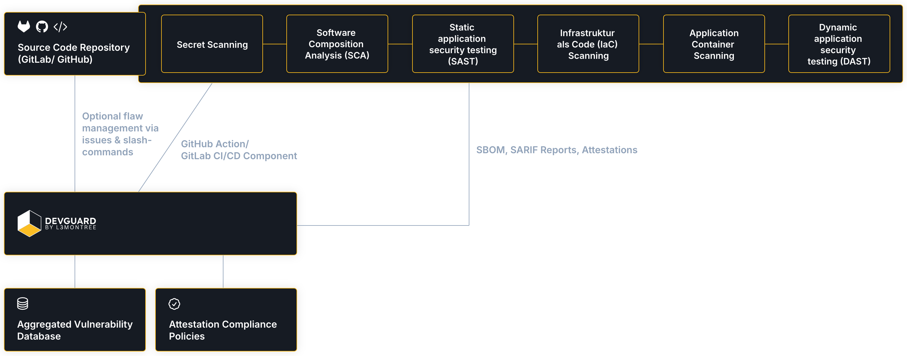

# Overview

The DevGuard CI/CD components implement the OWASP DevSecOps pipeline in an optimal way,
eliminating the need for extensive cybersecurity expertise. You can integrate the
DevGuard CI/CD pipeline with your repository on GitHub or GitLab.

Once integrated, the DevGuard CI/CD pipeline will scan your codebase, identify vulnerabilities,
and provide attestation and evidence for completed checks.

On DevGuard, you can manage, prioritize, and resolve vulnerabilities, achieve compliance, and
access additional features.

Let's get your release pre-flight checks done with DevGuard ✅ 🚀

## Architecture Overview

### DevGuard CI/CD Integration

Learn more about the DevSecOps pipeline steps and how they work together
in the [DevSecOps](/concepts/devsecops/understanding-owasp-devsecops-pipeline) section.

The pipeline steps are based on the OWASP DevSecOps pipeline, mixed with the concept to
gather evidence and attestation for actions performed in the pipeline.
The checks will report via SBOM or SARIF-report vulnerabilities to DevGuard. DevGuard
will help you manage, prioritize, and resolve found vulnerabilities.

For detailed setup instructions, refer to [setup GitHub integration](../gettingStarted/setup-github-integration)
or [setup GitLab integration](../gettingStarted/setup-gitlab-integration).

### Aggregated Vulnerability Database

DevGuard continuously monitors your project against known vulnerabilities.

To provide you with the most accurate and up-to-date information, and 
to help you prioritize your remediation efforts, we aggregate data from
multiple vulnerability databases (e.g., NVD, EPSS, OSV, Exploit DB, GitHub PoCs, etc.).

Learn more about the [aggregated vulnerability database](/concepts/aggregated-vulnerability-database)
and how it works.

### Vulnerability Management & Issue Synchronization

DevGuard provides a centralized view of all vulnerabilities in your codebase, allowing you to
prioritize and manage them effectively. Based on the aggregated vulnerability database,
you can see the risk level of each vulnerability and prioritize them accordingly.

You can also synchronize issues with external issue trackers, such as GitHub Issues
or GitLab Issues (more like Jira in the future). From the issues there, you
can also handle the vulnerability management process via slash commands.

Learn more in the [Vulnerability Management](/concepts/vulnerability-management) section.

### Attestation-Based Compliance

A core part of software supply chain security is the ability to securely
link the steps in the software supply chain to the final product, provide
evidence of the steps taken, and ensure that the final product is
built and deployed securely.

DevGuard records the evidence and provides attestation for each step in the
DevSecOps pipeline. This allows you to prove that necessary security checks
were performed and that the final product is secure. As an attestation is
actually a signed statement and DevGuard collects more evidence than just
the checks, you can use DevGuard to prove a lot of typical compliance
requirements (e.g. from ISO27001, PCI-DSS, etc.).

Learn more in the [Attestation & Provenance](/concepts/attestations-provenance)
section. 

For a detailed view into the policies written by the DevGuard community, check
out the [Attestation Compliance Policies GitHub Repo](https://github.com/l3montree-dev/attestation-compliance-policies).