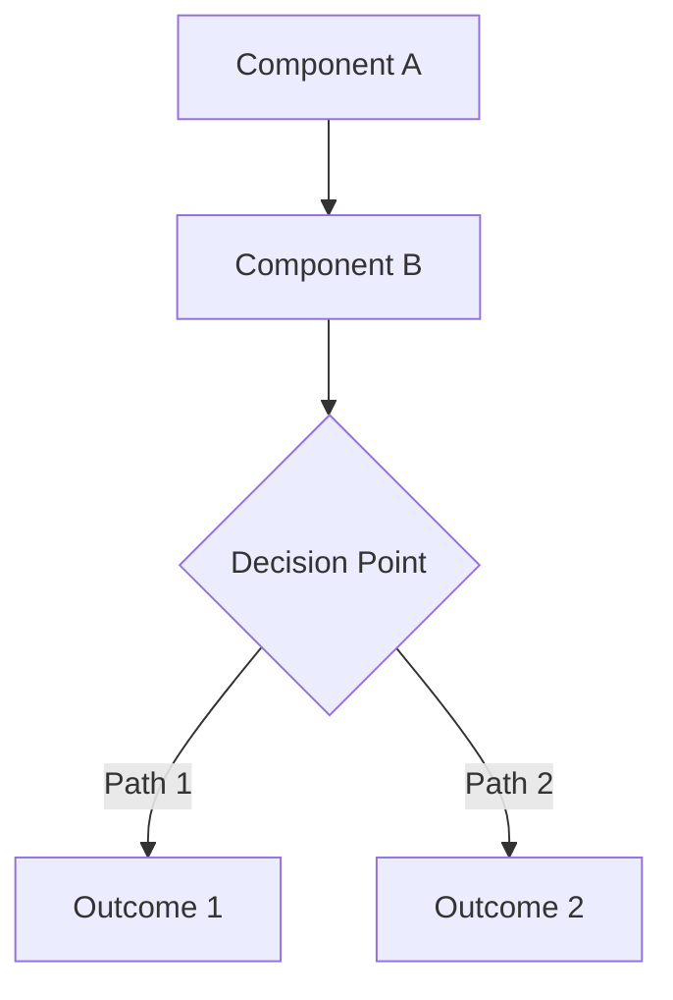
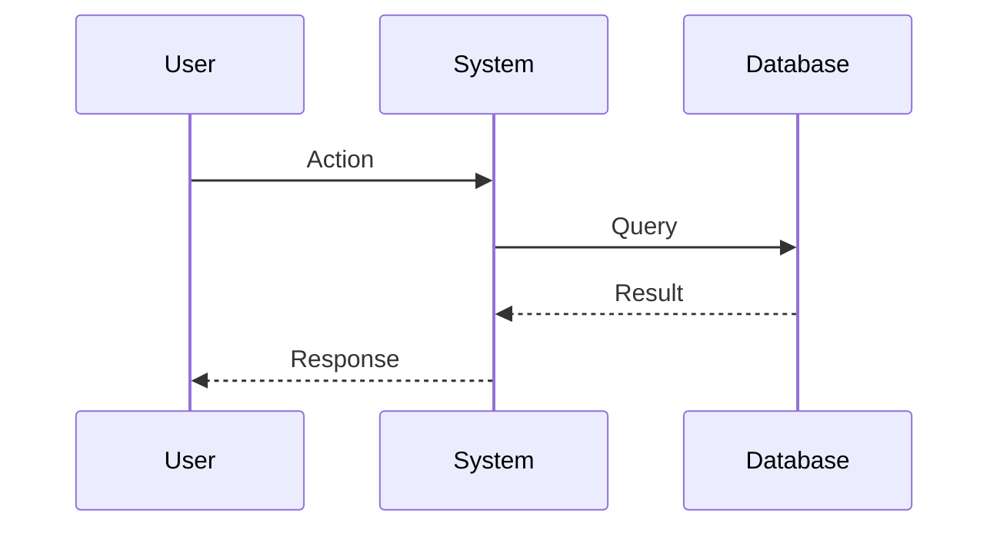

import { Callout } from 'nextra/components'

# Understanding [Concept Name]

Brief introduction that answers: **What is this concept and why does it matter?**

## Overview

High-level explanation of the concept:
- What problem does it solve?
- Why was it designed this way?
- When would you use it?

## The Problem

Explain the problem or challenge that this concept addresses:

- **Before this concept:** What was the pain point?
- **The challenge:** Why was the old way problematic?
- **The need:** What requirements needed to be met?

<Callout type="info">
  **Real-world analogy:** [Helpful analogy that makes the concept relatable]
</Callout>

## How It Works

### Core Mechanism

Detailed explanation of how the concept works:

1. **First principle:** Explanation
2. **Second principle:** Explanation  
3. **Third principle:** Explanation



### Key Components

#### Component 1: [Name]

What this component does and why it's important:
- Detail 1
- Detail 2
- Detail 3

#### Component 2: [Name]

Explanation of the second component...

#### Component 3: [Name]

Explanation of the third component...

## Architecture

How the components work together:



### Design Decisions

Why was it designed this way?

**Decision 1: [Design Choice]**
- **Rationale:** Why this choice was made
- **Trade-off:** What was given up
- **Benefit:** What was gained

**Decision 2: [Another Choice]**
- **Rationale:** Explanation
- **Alternative considered:** What else was considered
- **Why this is better:** Reasoning

## In Practice

### Typical Workflow

How this concept manifests in real usage:

```
1. [Step 1 in the workflow]
   ↓
2. [Step 2 in the workflow]
   ↓
3. [Step 3 in the workflow]
   ↓
4. [Final outcome]
```

### Example Scenario

**Scenario:** [Concrete example situation]

Let's walk through how [concept] works in this scenario:

1. **Initial state:** Description
2. **Action happens:** What triggers the concept
3. **System behavior:** How the system responds
4. **Final state:** What the outcome is

```json
{
  "example": "Concrete code or data example",
  "showing": "The concept in action"
}
```

## Relationship to Other Concepts

### Related Concept 1: [Name]

How this concept relates to [other concept]:
- **Connection:** How they're connected
- **Difference:** How they differ
- **When to use each:** Guidelines

### Related Concept 2: [Name]

Explanation of relationship...

## Common Patterns

### Pattern 1: [Pattern Name]

When you see this pattern in the wild:

```
Example of the pattern
```

**Why it works:** Explanation

### Pattern 2: [Another Pattern]

Description of another common pattern...

## Advantages and Limitations

### Advantages ✅

What makes this approach beneficial:
- **Advantage 1:** Explanation
- **Advantage 2:** Explanation
- **Advantage 3:** Explanation

### Limitations ⚠️

What to be aware of:
- **Limitation 1:** Explanation and workaround
- **Limitation 2:** Explanation and workaround

### Trade-offs

What you gain vs. what you give up:

| Gain | Cost |
|------|------|
| Benefit 1 | Trade-off 1 |
| Benefit 2 | Trade-off 2 |

## Best Practices

### Do's ✅

- **Practice 1:** Why this is recommended
- **Practice 2:** Why this is recommended
- **Practice 3:** Why this is recommended

### Don'ts ❌

- **Anti-pattern 1:** Why to avoid this
- **Anti-pattern 2:** Why to avoid this

<Callout type="warning">
  **Common Mistake:** Description of a frequent misunderstanding
  
  **Why it's wrong:** Explanation
  
  **What to do instead:** Correct approach
</Callout>

## Evolution and History

### Why It Was Created

Historical context:
- **Original problem:** What triggered its creation
- **Design goals:** What it aimed to achieve
- **Influences:** What inspired the design

### How It's Changed

Evolution over time:
- **Version 1:** Original implementation
- **Version 2:** Key improvements
- **Current state:** Modern implementation

### Future Direction

Where this concept is heading:
- **Planned improvements:** What's coming
- **Open questions:** Challenges being explored

## Deep Dive: [Advanced Topic]

For those wanting to go deeper:

### Internal Implementation

Lower-level details of how it works:

```go
// Code example showing implementation details
func InternalMechanism() {
    // Explanation of internal logic
}
```

### Performance Characteristics

- **Time complexity:** O(n) explanation
- **Space complexity:** Memory usage
- **Scalability:** How it scales

### Edge Cases

Unusual situations and how they're handled:

**Edge Case 1:** [Scenario]
- **Behavior:** What happens
- **Why:** Explanation

## FAQ

### Q: [Common Question 1]?

**A:** Detailed answer explaining the concept from this angle.

### Q: [Common Question 2]?

**A:** Answer addressing this perspective.

### Q: How is this different from [similar concept]?

**A:** Clear comparison and distinction.

## Real-World Applications

### Use Case 1: [Industry Example]

How [company/project] uses this concept:
- **Challenge:** Their problem
- **Solution:** How they applied the concept
- **Outcome:** Results achieved

### Use Case 2: [Another Example]

Different application of the concept...

## Practical Examples

See these guides for hands-on application:
- [Tutorial: Using this concept] - Link
- [How-to: Implement pattern X] - Link
- [How-to: Configure Y] - Link

## Further Reading

### Internal Resources
- [Related Concept 1] - Link to explanation
- [Related Concept 2] - Link to explanation

### External Resources
- [Academic Paper] - Link
- [Blog Post] - Link
- [Video Explanation] - Link

## Key Takeaways

- 🎯 **Key Point 1:** Main insight
- 🎯 **Key Point 2:** Main insight  
- 🎯 **Key Point 3:** Main insight

<Callout type="info">
  **Remember:** Core principle to keep in mind
</Callout>

---

<Callout type="default">
  **Was this helpful?** [Yes](#) | [No](#) | [Edit this page](link-to-github)
</Callout>
