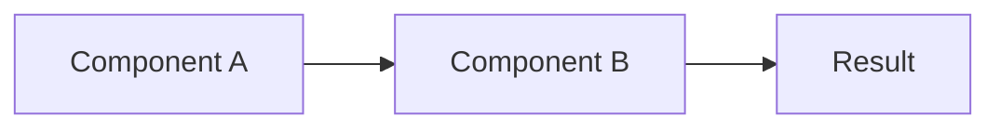

import { Callout } from 'nextra/components'
import { Steps } from 'nextra/components'
import { Tabs } from 'nextra/components'

# [Tutorial Title]: [What Users Will Learn]

<Callout type="info">
  **What you'll learn:** Brief bullet list of learning outcomes
  - Outcome 1
  - Outcome 2
  - Outcome 3
</Callout>

## Overview

Brief introduction explaining:
- What this tutorial covers
- Who it's for
- What you'll build/accomplish
- Expected time commitment

## Prerequisites

Before starting this tutorial, you should have:
- ✅ Prerequisite 1 (with link)
- ✅ Prerequisite 2 (with link)
- ✅ Basic understanding of [concept]

## What You'll Build

Brief description or screenshot of the end result.

---

<Steps>

### Step 1: [First Major Step]

Clear explanation of what this step accomplishes.

**Action:**
```bash
# Command or code with clear comments
command --with-flags
```

**Expected output:**
```
Show what users should see
```

<Callout type="tip">
  **Pro tip:** Additional helpful information
</Callout>

**Verify:**
How to verify this step worked correctly.

---

### Step 2: [Second Major Step]

Continue with the same pattern...

```yaml
# Configuration example
key: value
```

<Callout type="warning">
  **Important:** Critical information users must know
</Callout>

---

### Step 3: [Third Major Step]

For multiple options, use tabs:

<Tabs items={['Option A', 'Option B']}>
  <Tabs.Tab>
    ```bash
    # Command for Option A
    ```
  </Tabs.Tab>
  <Tabs.Tab>
    ```bash
    # Command for Option B
    ```
  </Tabs.Tab>
</Tabs>

---

### Step 4: [Verification Step]

Final verification that everything works:

```bash
# Verification command
```

✅ **Success criteria:**
- [ ] Criterion 1
- [ ] Criterion 2
- [ ] Criterion 3

</Steps>

---

## Understanding What You Built

Explanation section:
- What did we actually do?
- Why did we do it this way?
- How does it work?



## Common Issues

### Issue 1: [Problem Description]

**Symptoms:**
- What users might see

**Solution:**
```bash
# Fix command
```

### Issue 2: [Another Problem]

**Symptoms:**
- What users might see

**Solution:**
Step-by-step fix.

## Next Steps

Now that you've completed this tutorial, you can:

1. **[Next Tutorial]** - Link to next logical tutorial
2. **[Related How-to]** - Link to task-focused guide
3. **[Advanced Concept]** - Link to deeper explanation

## Additional Resources

- [Official Documentation Link]
- [Related Tutorial]
- [Community Resources]

---

<Callout type="default">
  **Was this tutorial helpful?** [Yes](#) | [No](#) | [Edit this page](link-to-github)
</Callout>
